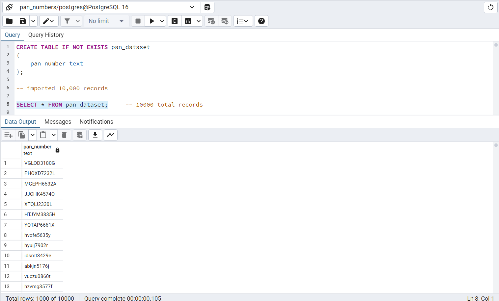
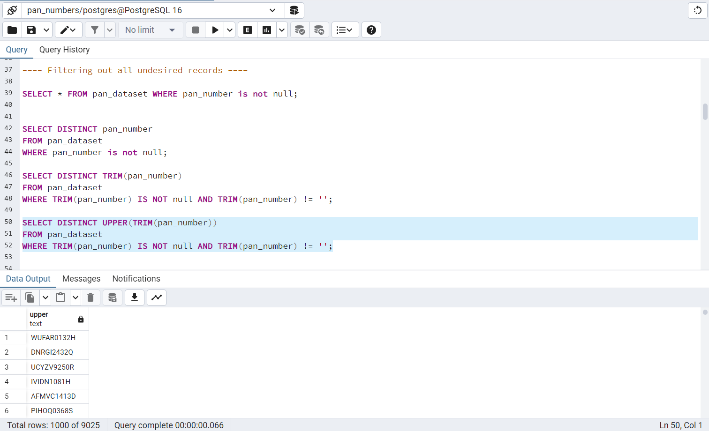
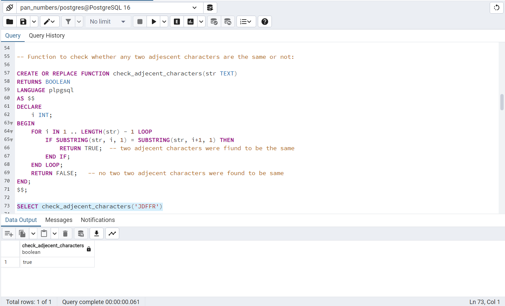
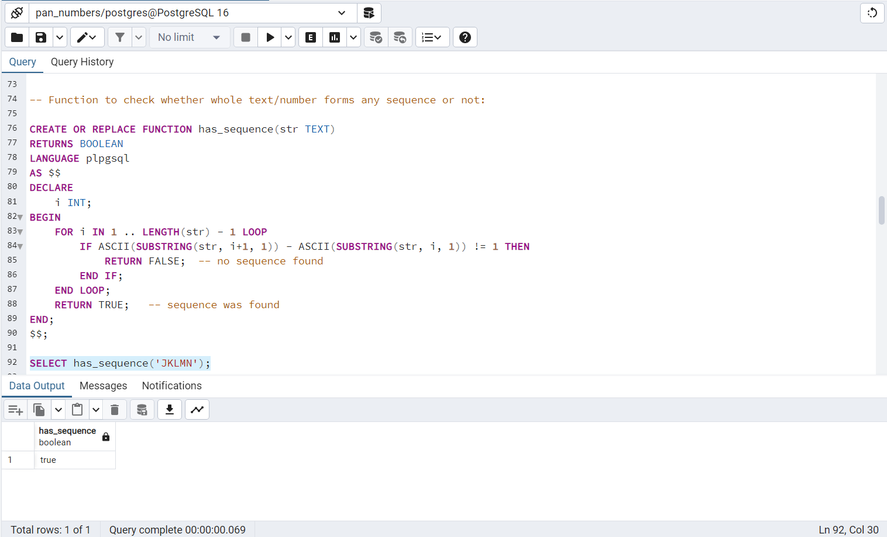
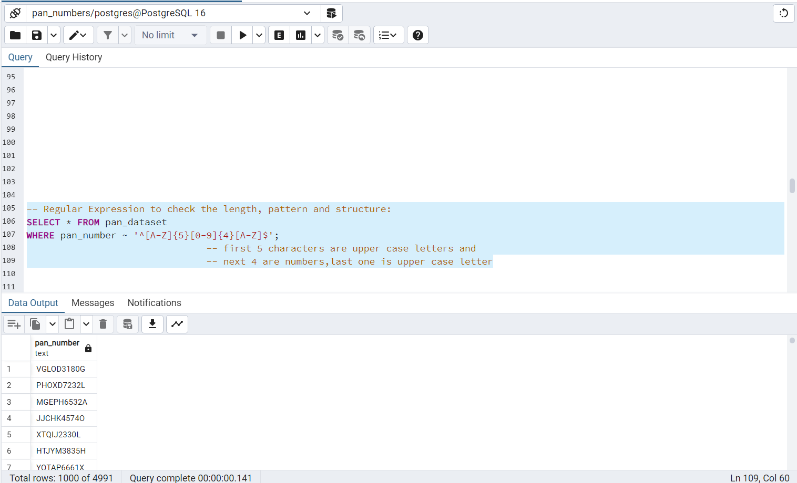
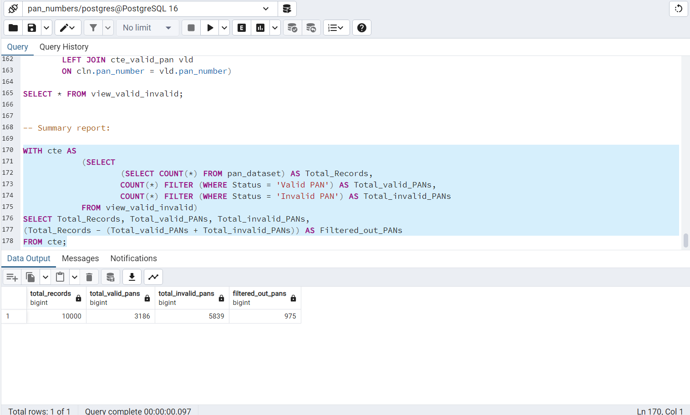

<p align="center">
  
</p>

# PAN Card Validation from CSV using PostgreSQL

<details open>
<summary><strong><span style="font-size: 1.25em;">Executive Summary and Overview</span></strong></summary>
<br>

The PAN Card Validation project ensures that Indian Permanent Account Numbers (PAN) from a raw CSV dataset are cleaned, validated, and categorized according to official compliance standards.  
The process removes duplicates, standardizes formatting, and applies logical and structural validation using SQL functions and regular expressions in PostgreSQL.  

The output is:
- A compliance-ready dataset with only valid PANs
- A clear categorization of valid and invalid entries
- Summary metrics for reporting and compliance purposes

</details>

---

## Table of Contents
<br>

- [Project Objectives](#project-objectives)
- [Dataset Overview](#dataset-overview)
- [Data Cleaning Process](#data-cleaning-process)
- [Validation Logic](#validation-logic)
- [Results Summary](#results-summary)
- [Technologies Used](#technologies-used)
- [Folder Structure](#folder-structure)
- [Business Value](#business-value)
- [Acknowledgments](#acknowledgments)
- [Contact](#contact)

---

<details>
<summary id="project-objectives"><strong>Project Objectives</strong></summary>
<br>

- Load and process raw CSV data containing PAN numbers into PostgreSQL.
- Standardize all PAN numbers to uppercase and remove unwanted spaces.
- Remove incomplete or duplicate entries.
- Validate PANs against official format rules and logical constraints.
- Categorize each PAN as **Valid** or **Invalid**.
- Generate summary counts for reporting.

</details>

---

<details>
<summary id="dataset-overview"><strong>Dataset Overview</strong></summary>
<br>

- **Source:** Provided raw CSV file with 10,000 records.
- **Field(s):** Single column containing PAN numbers.
- **Initial Issues Identified:**
  - 965 null or missing values
  - 6 types of duplicates
  - 9 entries with extra spaces
  - 990 entries with lowercase letters

The dataset was imported into a PostgreSQL table named `pan_dataset` for processing.

<p align="center">
  
</p>

</details>

---

<details>
<summary id="data-cleaning-process"><strong>Data Cleaning Process</strong></summary>
<br>

- Removed null and empty PAN entries.
- Trimmed leading/trailing spaces using `TRIM()`.
- Converted all PAN numbers to uppercase with `UPPER()`.
- Removed duplicates using `DISTINCT`.

All cleaning was executed directly within PostgreSQL to ensure consistency and scalability.

<p align="center">
  
</p>

</details>

---

<details>
<summary id="validation-logic"><strong>Validation Logic</strong></summary>
<br>

**PAN Format Rules:**
- Exactly 10 characters long
- Format: `AAAAA9999A` (5 letters, 4 digits, 1 letter)
- No two adjacent characters (letters or digits) can be identical
- First 5 letters must not form a sequence (e.g., `ABCDE` invalid)
- Next 4 digits must not form a sequence (e.g., `1234` invalid)

**Implementation in PostgreSQL:**
- **Regular Expressions** to match the general structure  
- **User-Defined Functions (UDFs):**
  - `check_adjecent_characters()` → detects repeated adjacent characters
  - `has_sequence()` → detects alphabetical or numerical sequences
- **Common Table Expressions (CTEs)** to create:
  - Cleaned dataset
  - Valid PAN subset
  - Final combined table with "Valid" or "Invalid" status

<p align="center">
  
</p>

<p align="center">
  
</p>

<p align="center">
  
</p>

</details>

---

<details>
<summary id="results-summary"><strong>Results Summary</strong></summary>
<br>

| Total Records | Valid PANs | Invalid PANs | Filtered Out |
|--------------:|-----------:|-------------:|-------------:|
| 10,000        | 3,186      | 5,839        | 975          |

<p align="center">
  
</p>

</details>

---

<details>
<summary id="technologies-used"><strong>Technologies Used</strong></summary>
<br>

| Tool / Technology  | Purpose                                        |
|--------------------|------------------------------------------------|
| PostgreSQL         | Data loading, cleaning, and validation logic   |
| SQL Functions      | Custom UDFs for pattern and sequence checks    |
| Regular Expressions| Pattern-based PAN structure validation         |
| CSV                | Source data format for raw records             |

</details>

---

<details>
<summary id="folder-structure"><strong>Folder Structure</strong></summary>
<br>

```bash
pan-card-validation-csv-postgresql/
│
├── README.md
│
├── assets/
│   └── logo.jpeg
│
├── data/
│   └── raw_csv_dataset.csv
│
├── documents/
│   └── problem_statement.pdf
│
├── report/
│   └── final_report.docx
│
├── script/
│   └── postgresql_solution_script.sql
│
├── visuals/
│   ├── P1.png
│   ├── P2.png
│   ├── P3.png
│   ├── P4.png
│   ├── P5.png
│   └── P6.png

```
</details>

---

<details> <summary id="business-value"><strong>Business Value</strong></summary>
<br>
  
- Compliance Assurance: Ensures all PANs adhere to official guidelines.

- Data Quality: Removes invalid or suspicious entries before further processing.

- Efficiency: Automates validation, reducing manual verification workload.

- Risk Mitigation: Flags problematic PANs before they cause compliance issues.

</details>

---

<details> <summary id="acknowledgments"><strong>Acknowledgments</strong></summary>
<br>
  
- Dataset provided as part of project requirements.

- PostgreSQL documentation for UDF and regex functions.

</details>

---

<details> <summary id="contact"><strong>Contact</strong></summary>
<br>
  
- Author: Rajdeep Ray
- Phone: +91 7076918307
- Email: rajdeepray.c48.it@gmail.com
- GitHub: https://github.com/deadlineZeus/pan-card-validation-postgresql
- LinkedIn: https://www.linkedin.com/in/rajdeep-ray-3616501b6/

</details>

---
